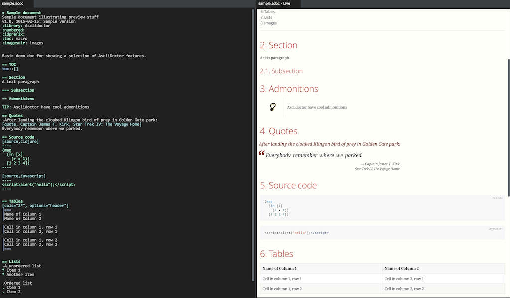

= AsciiLight
Preview of AsciiDoc files
v1.0, 2015-02-15: Initial release
:library: Asciidoctor
:numbered:
:idprefix:
:toc: macro

AsciiLight is a simple plugin for displaying a preview of http://asciidoctor.org[AsciiDoctor] documents. It uses the
https://github.com/asciidoctor/asciidoctor.js[asciidoctor.js] npm module for doing most of the hard work.

== Installation
Install through the LightTable plugin manager.

== Usage
With your .adoc file open, open the command bar in (ctrl+space/cmd+space) and select
*AsciiLight: Watch this editor for changes*

.Preview

== Limitiations
.Probably plenty, a few that springs to mind
* No source code highlighting (yet)
* Not really tested with any advanced AsciiDoc features

== Contributing
Pull requests are most welcome. Please do not include the transpiled files (*_compiled*) in the PR.

== History
* 0.1.0 Initial release: Basic features, just to get the ball rolling.
